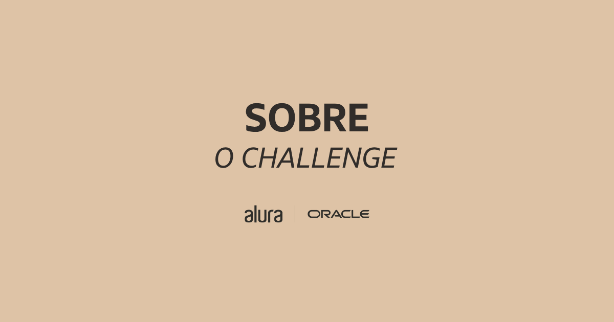
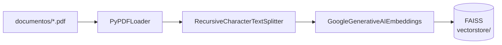
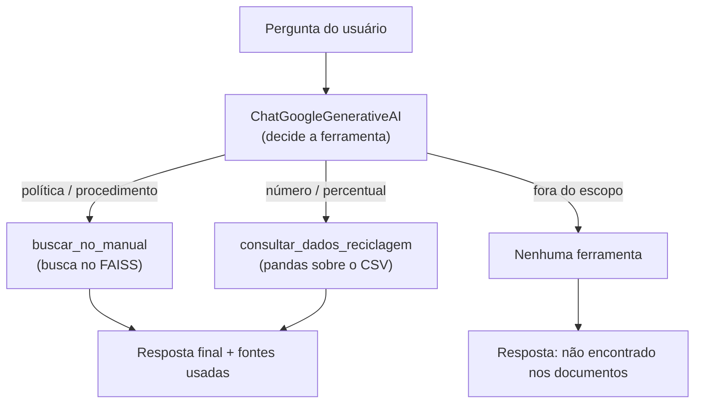

<p align="center">
  
</p>

# ♻️ Alura Agent — Agente de IA para Documentos Internos


Projeto do desafio final **Alura Agent** (Alura + Oracle). Um agente de inteligência artificial
que responde perguntas sobre documentos internos da **Alpande Tech** — o manual de política de
gestão de materiais recicláveis (PDF) e o relatório mensal de reciclagem (CSV) — eliminando a
necessidade de buscar as informações manualmente.

## Sumário

- [Descrição geral](#descrição-geral)
- [Arquitetura da solução](#arquitetura-da-solução)
- [Tecnologias e ferramentas](#tecnologias-e-ferramentas)
- [Estrutura do projeto](#estrutura-do-projeto)
- [Como executar localmente](#como-executar-localmente)
- [Testes](#testes)
- [Exemplos de perguntas e respostas](#exemplos-de-perguntas-e-respostas)
- [Deploy na Oracle Cloud Infrastructure (OCI)](#deploy-na-oracle-cloud-infrastructure-oci)
- [Licença](#licença)

## Descrição geral

O agente combina duas técnicas, escolhendo a certa para cada tipo de pergunta:

- **RAG (Retrieval-Augmented Generation)** para perguntas sobre políticas e procedimentos do
  manual em PDF: o conteúdo é indexado em um banco vetorial e, a cada pergunta, os trechos mais
  relevantes são recuperados para servir de contexto ao modelo.
- **Consulta estruturada com pandas** para perguntas numéricas/percentuais sobre o relatório
  mensal em CSV (médias, totais, valores por mês/material): os dados são consultados diretamente
  com pandas, garantindo que os números sejam calculados corretamente, não "adivinhados" pelo
  modelo.

O agente é implementado como um **agente com tool-calling** (Gemini function calling): a cada
pergunta, o próprio modelo decide qual ferramenta usar (busca no manual, consulta ao CSV, ou
nenhuma, quando a informação não está disponível).

## Arquitetura da solução

1. **Ingestão (offline)** — roda uma vez (ou sempre que o PDF mudar):
   PDF → divisão em *chunks* → embeddings (Gemini) → índice vetorial FAISS salvo em disco.
2. **Consulta (online, na interface)** — a cada pergunta do usuário, o Gemini decide qual
   ferramenta chamar:
   - `buscar_no_manual`: busca os *chunks* mais similares no FAISS (manual em PDF).
   - `consultar_dados_reciclagem`: calcula média/total/máximo/mínimo sobre o CSV com pandas,
     usando apenas parâmetros escolhidos pelo modelo (mês, material, métrica, operação) — o
     modelo **nunca executa código livre**, só valores de um conjunto fixo permitido.
   O resultado da ferramenta volta para o modelo, que gera a resposta final em português. A
   interface exibe a resposta e, num painel expansível, qual ferramenta foi usada e com que dados.





### Por que não um "agente pandas" com execução livre de código?

O LangChain oferece um padrão pronto (`create_pandas_dataframe_agent`) que deixa o modelo executar
código Python livremente sobre o CSV. Como esta aplicação fica **pública na internet** após o
deploy, isso abriria uma brecha real de execução remota de código (qualquer visitante poderia
tentar manipular a pergunta para rodar código arbitrário no servidor). Por isso, a ferramenta
`consultar_dados_reciclagem` foi implementada de forma restrita: o modelo só escolhe parâmetros
(mês, material, métrica, operação) dentro de listas fixas, e uma função Python comum faz o cálculo
com pandas — sem nenhum código gerado pelo modelo sendo executado.

### Por que um loop de tool-calling manual em vez do `AgentExecutor` do LangChain?

A primeira versão usava `create_tool_calling_agent` + `AgentExecutor`, a forma "oficial" do
LangChain para agentes com ferramentas. Na prática, essa combinação com os modelos Gemini mais
recentes (via `langchain-google-genai`) falhava com o erro `Function call is missing a
thought_signature in functionCall parts` — um requisito novo da API do Gemini para chamadas de
função que o `AgentExecutor` ainda não propaga corretamente entre turnos (ele reconstrói o
histórico de mensagens ao chamar `.stream()` internamente e perde essa informação). Em vez de
mascarar o problema, o agente foi reescrito com um **loop de tool-calling manual** (`llm.bind_tools`
+ um laço que executa as ferramentas chamadas e devolve o resultado ao modelo), o que resolveu o
erro e deixou o fluxo do agente mais explícito e fácil de acompanhar (veja `responder()` em
`src/agente.py`).

## Tecnologias e ferramentas

- **Python 3.11+**
- **LangChain** (`langchain`, `langchain-community`, `langchain-text-splitters`,
  `langchain-google-genai`) — orquestração do agente e das ferramentas
- **Google Gemini** — `gemini-flash-latest` (geração de respostas e tool-calling) e
  `models/gemini-embedding-001` (embeddings)
- **pypdf** — leitura do PDF (via `PyPDFLoader`)
- **pandas** — leitura e agregação do relatório mensal de reciclagem (CSV)
- **FAISS** (`faiss-cpu`) — índice vetorial local, sem depender de banco de dados externo
- **Streamlit** — interface web de chat
- **python-dotenv** — carregamento da chave de API a partir de `.env`

## Estrutura do projeto

```
.
├── app.py                    # interface de chat (Streamlit)
├── src/
│   ├── ingestao.py                    # lê o PDF e constrói o índice FAISS
│   └── agente.py                       # agente com tool-calling (busca no manual + pandas)
├── tests/
│   └── test_agente.py                  # testes unitários da lógica de cálculo (pandas)
├── documentos/
│   ├── manual_reciclagem.pdf           # manual de reciclagem (fonte para o RAG)
│   └── relatorio_reciclagem_mensal.csv # relatório mensal de % reciclado (fonte para o pandas)
├── assets/
│   └── banner-challenge.png            # banner do desafio (Alura + Oracle)
├── vectorstore/               # índice FAISS gerado (não versionado)
├── requirements.txt
├── requirements-dev.txt       # dependências extras para rodar os testes
├── .env.example
├── LICENSE
└── .gitignore
```

## Como executar localmente

1. Clone o repositório e entre na pasta do projeto.
2. Crie e ative um ambiente virtual:
   ```bash
   python -m venv .venv
   # Windows
   .venv\Scripts\activate
   # Linux/Mac
   source .venv/bin/activate
   ```
3. Instale as dependências:
   ```bash
   pip install -r requirements.txt
   ```
4. Copie `.env.example` para `.env` e preencha sua chave do Gemini (crie uma gratuitamente em
   https://aistudio.google.com/apikey):
   ```
   GOOGLE_API_KEY=sua_chave_aqui
   ```
5. Gere o índice vetorial a partir do(s) PDF(s) em `documentos/`:
   ```bash
   python src/ingestao.py
   ```
   *(o CSV de reciclagem é lido diretamente com pandas em tempo de consulta, não precisa de
   ingestão/índice.)*
6. Rode a aplicação:
   ```bash
   streamlit run app.py
   ```
7. Acesse http://localhost:8501 no navegador.

Para usar outro PDF, basta colocá-lo em `documentos/` e rodar novamente o passo 5. Para usar outro
CSV, ajuste o nome do arquivo e as colunas esperadas em `src/agente.py`.

## Testes

A lógica de cálculo sobre o CSV (`calcular_dados_reciclagem`, em `src/agente.py`) tem testes
unitários que **não** chamam a API do Gemini nem precisam do índice FAISS — rodam em segundos e
sem chave de API configurada:

```bash
pip install -r requirements-dev.txt
pytest
```

## Exemplos de perguntas e respostas

**Pergunta:** Qual a cor da lixeira para plástico?
**Resposta:** A cor da lixeira para plástico é vermelha.
*(ferramenta usada: `buscar_no_manual`)*

**Pergunta:** Como devo descartar equipamentos eletrônicos?
**Resposta:** De acordo com o manual de reciclagem, os equipamentos eletrônicos (como notebooks,
monitores, celulares corporativos, cabos e baterias) devem ser descartados seguindo o
procedimento: 1) entrega exclusiva ao setor de TI; 2) preenchimento do Formulário de Baixa de
Ativo (FBA-07); 3) o setor de TI realiza a limpeza dos dados antes de enviar o material à empresa
parceira especializada em descarte de e-lixo (GreenTech Reciclagem).
*(ferramenta usada: `buscar_no_manual`)*

**Pergunta:** Qual a média do percentual reciclado de papel nos últimos meses?
**Resposta:** A média do percentual reciclado de papel nos últimos meses é de 72,07%.
*(ferramenta usada: `consultar_dados_reciclagem`, calculado com pandas sobre o CSV)*

**Pergunta:** Qual o percentual reciclado de metal em março de 2026?
**Resposta:** O percentual reciclado de metal em março de 2026 foi de 76,10%.
*(ferramenta usada: `consultar_dados_reciclagem`)*

**Pergunta:** Qual a capital da França?
**Resposta:** Desculpe, não encontrei a informação nos documentos disponíveis. Minhas ferramentas
são restritas a responder dúvidas sobre o manual de reciclagem e os relatórios de reciclagem da
empresa.
*(nenhuma ferramenta chamada — o agente reconhece que a pergunta está fora do escopo, em vez de
inventar uma resposta)*

## Deploy na Oracle Cloud Infrastructure (OCI)

Passo a passo para publicar a aplicação em uma VM **OCI Compute** (elegível ao Always Free):

1. Crie uma instância de Compute (imagem Ubuntu 22.04, shape `VM.Standard.A1.Flex` ou
   `VM.Standard.E2.1.Micro`, ambos no nível Always Free).
2. Conecte via SSH e instale os pré-requisitos:
   ```bash
   sudo apt update && sudo apt install -y python3-venv git
   ```
3. Clone o repositório e configure o ambiente (repita os passos 2–5 de "Como executar localmente").
4. Libere a porta 8501:
   - Na **Security List/NSG** da VCN: adicione uma regra de ingresso para a porta 8501 (TCP).
   - No firewall do sistema operacional:
     ```bash
     sudo iptables -I INPUT -p tcp --dport 8501 -j ACCEPT
     ```
5. Suba a aplicação expondo-a publicamente:
   ```bash
   streamlit run app.py --server.address 0.0.0.0 --server.port 8501
   ```
6. Acesse `http://<IP_PÚBLICO_DA_VM>:8501`.

Opcionalmente, configure um serviço `systemd` para manter a aplicação no ar após reinicializações.

**Evidência do deploy:** _(adicionar aqui o link público da aplicação e/ou uma captura de tela da
aplicação em execução na OCI)_.

## Licença

Distribuído sob a licença MIT — veja [LICENSE](LICENSE) para mais detalhes.
